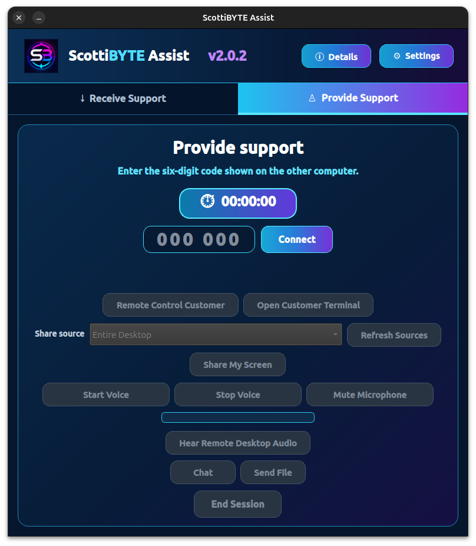
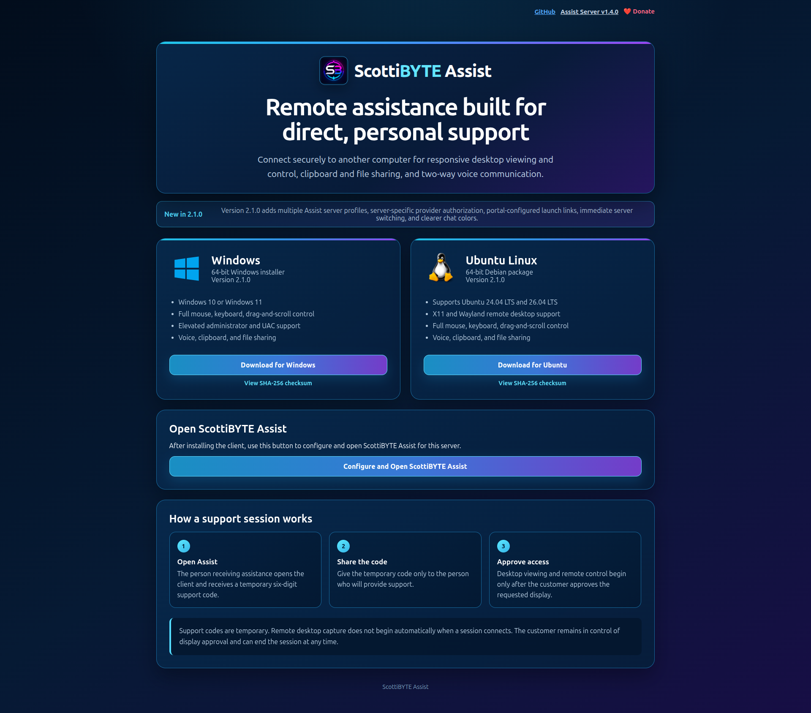

# ScottiBYTE Assist

**ScottiBYTE Assist** is an open-source, self-hosted remote
assistance platform for Windows and Linux.

It is designed as an alternative to remote-support and
remote-access products such as TeamViewer, Chrome Remote
Desktop, AnyDesk, LogMeIn, RustDesk, and MeshCentral, while
taking a deliberately different approach to how remote access
is established.

## Remote assistance, not unattended remote access

ScottiBYTE Assist is designed specifically for **attended
remote assistance**.

It is deliberately not designed to provide persistent,
unattended access to computers.

The person receiving assistance starts the process. ScottiBYTE
Assist creates a temporary six-digit support code, which the
customer gives to an authorized provider. Connecting with that
code does not automatically expose the customer's desktop.
Desktop viewing and remote control begin only after the
customer approves access.

When the support session ends, the temporary session ends with
it.

This design avoids turning ScottiBYTE Assist into a permanent
remote-access mechanism waiting on a computer for someone to
connect.

## Why ScottiBYTE Assist is different

Many remote-access products are designed around persistent
device enrollment, unattended access, centralized cloud
services, or a combination of those models.

ScottiBYTE Assist was designed around a narrower purpose:
**helping another person while that person is present.**

Its design emphasizes:

- **Customer-initiated sessions.** The person receiving help
  creates the support session.

- **Temporary support codes.** Each support session uses a
  temporary six-digit code rather than a permanent computer
  access ID.

- **Customer approval.** Establishing a support session does
  not automatically begin desktop capture or remote control.
  The customer approves desktop access.

- **Authorized providers.** Support providers are enrolled and
  authorized by the ScottiBYTE Assist server rather than being
  granted access merely because they know a support code.

- **No unattended-access mode.** ScottiBYTE Assist is not
  intended to leave behind a permanent remote-control path to
  a computer.

- **Self-hosting.** The Assist server, administration system,
  signaling services, and download portal can run on
  infrastructure controlled by the organization or individual
  using it.

- **Cross-platform support.** Native clients support Windows
  and Ubuntu Linux, including Linux systems using X11 or
  Wayland.

- **Integrated support tools.** A support session can include
  remote desktop viewing and control, two-way voice, text
  chat, clipboard sharing, and file transfer.

- **Provider administration and auditing.** The self-hosted
  server manages provider authorization and records the
  security-relevant lifecycle of support sessions.

The goal is not to reproduce every feature of a general-purpose
remote-access platform. ScottiBYTE Assist intentionally focuses
on the workflow required for secure, person-to-person remote
technical assistance.

## How ScottiBYTE Assist works

A person requesting assistance opens the ScottiBYTE Assist
client and receives a temporary six-digit support code. An
authorized provider enters that code to establish the support
session.

During an approved session, ScottiBYTE Assist can provide
remote desktop viewing and control, two-way voice, text chat,
clipboard sharing, and file transfer.

ScottiBYTE Assist consists of three primary components: the
self-hosted server and portal, the Windows client, and the
Ubuntu Linux client.

## Components

### ScottiBYTE Assist Server

The self-hosted server provides:

- the public download portal
- session creation and coordination
- provider authorization and enrollment
- administrator and provider management
- WebSocket signaling and session communication
- HTTP-mediated file transfer
- session auditing
- persistent SQLite configuration and state
- release information for the server and clients

The server is distributed as a Docker image and is designed so
that application updates can replace the container while
persistent server data remains outside the container.

### Windows client

The native Windows client provides both receiving and providing
remote assistance, including:

- desktop viewing and remote control
- mouse and keyboard input
- administrator and UAC support
- two-way voice
- text chat
- clipboard sharing
- file transfer

### Ubuntu Linux client

The native Linux client provides both receiving and providing
remote assistance, including:

- X11 and Wayland desktop support
- desktop viewing and remote control
- mouse and keyboard input
- two-way voice
- text chat
- clipboard sharing
- file transfer

## ScottiBYTE Assist Portal

The self-hosted portal provides the current Windows and Linux
client downloads, checksum links, server release information,
and access to the administrator interface.

## How a support session works

1. The person receiving assistance opens ScottiBYTE Assist.
2. The client creates a temporary support session and displays
   a six-digit code.
3. The customer gives that code to an authorized provider.
4. The provider enters the code in ScottiBYTE Assist.
5. The customer approves desktop access.
6. The support session can then provide remote control, voice,
   chat, clipboard sharing, and file transfer.
7. Either participant can end the support session.

Support codes are temporary and should be shared only with the
person providing assistance.

## First-time server installation

A new ScottiBYTE Assist server requires a one-time bootstrap
procedure.

When a new server starts with no provider credentials, it
generates a one-time setup code. The code is displayed in the
server's Docker logs and is entered on the first computer that
will administer the Assist server.

During initial setup, the first provider enters the one-time
setup code and chooses the administrator password. The server
authorizes that provider computer as the first **superuser**.

The complete bootstrap procedure is included in the
**[Server Installation](docs/installation.md)** guide.

## Installation

The ScottiBYTE Assist server is distributed as a Docker image.

The **[Server Installation](docs/installation.md)** guide covers
Docker Compose deployment, DNS, HTTPS, reverse-proxy
configuration, first-provider setup, provider administration,
client installation, and server updates.

## HTTPS and reverse proxy

Production deployments should place ScottiBYTE Assist behind an
HTTPS reverse proxy.

The Assist application trusts one reverse-proxy hop for client
address information. Port **3089 must not be exposed directly
to the public Internet** when using this configuration.

Nginx Proxy Manager is supported and requires configuration
appropriate for long-running Assist sessions, WebSocket
traffic, and streamed file transfers.

The complete Nginx Proxy Manager configuration is included in
the **[Server Installation](docs/installation.md)** guide.

## Provider administration

The first provider created during bootstrap is a superuser.

A superuser can use the Assist administration portal to create
enrollment codes for additional providers, view provider
authorization, rename providers, and revoke provider access.

Provider administration and enrollment are documented in the
**[Server Installation](docs/installation.md)** guide.

## Using ScottiBYTE Assist

The **[Server Installation](docs/installation.md)** guide
includes an overview of receiving support, providing support,
remote desktop operation, voice, chat, clipboard sharing, and
file transfer.

## Documentation

- **[Installation](docs/installation.md)** — server deployment,
  Docker Compose, HTTPS, reverse proxy, first-provider setup,
  provider administration, client installation, usage, and
  upgrades
- **[Architecture](docs/architecture.md)** — system components,
  authorization, session lifecycle, transport, relay behavior,
  file transfer, and security boundaries
- **[Session Protocol](docs/session-protocol.md)** — technical
  REST, WebSocket, signaling, relay, and file-transfer protocol
  reference

## Project

ScottiBYTE Assist is developed by ScottiBYTE as a self-hosted
remote-support platform with native Windows and Linux clients.

Release information and source code are published through the
ScottiBYTE Assist GitHub repository.
