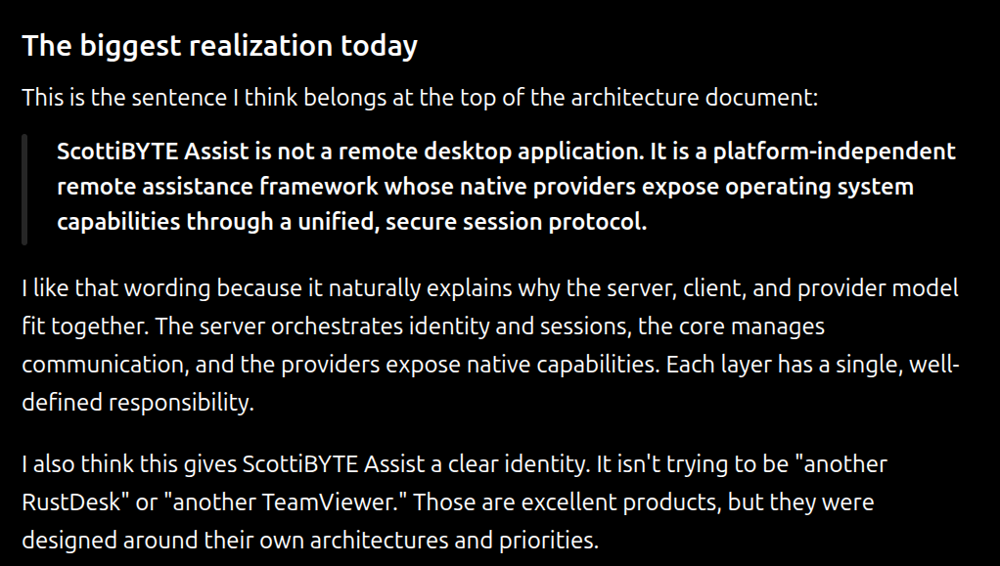

# ScottiBYTE Assist Architecture

## Overview

ScottiBYTE Assist is a self-hosted attended remote-assistance platform
for Windows and Linux computers.

The architecture separates server-side authorization and session
coordination from the native remote-assistance functions performed by
ScottiBYTE Assist clients.



The ScottiBYTE Assist server provides:

- provider authorization
- provider enrollment
- administrator authentication
- customer session creation and authorization
- session coordination
- WebSocket signaling
- authenticated binary relay services
- HTTP file transfer
- session auditing
- customer audit receipts
- client downloads and release information

The Windows and Linux clients provide the native remote-assistance
experience, including desktop viewing, remote control, voice, desktop
audio, clipboard operations, chat, and file transfer.

---

## Major Components

A typical ScottiBYTE Assist deployment contains:

1. A ScottiBYTE Assist customer client
2. A ScottiBYTE Assist provider client
3. The ScottiBYTE Assist server
4. A reverse proxy
5. A SQLite database used by the server

The normal public architecture is:

```text
                         Internet
                            |
                        HTTPS / WSS
                            |
                    +----------------+
                    | Reverse Proxy  |
                    +-------+--------+
                            |
                         TCP 3089
                            |
                 +----------+----------+
                 | ScottiBYTE Assist   |
                 | Server              |
                 |                     |
                 | REST API            |
                 | WebSocket signaling |
                 | Provider auth       |
                 | Session management  |
                 | Binary relay        |
                 | File transfer       |
                 | Audit records       |
                 +----------+----------+
                            |
                         SQLite
```

Both customer and provider clients communicate with the ScottiBYTE
Assist server through the public HTTPS/WSS address.

The server coordinates the session and provides transport services when
required by the clients.

---

## Public Network Boundary

The reverse proxy is the intended public entry point for ScottiBYTE
Assist.

A typical deployment exposes:

```text
https://assist.example.com
```

on TCP 443.

The reverse proxy forwards HTTP and WebSocket traffic to the ScottiBYTE
Assist server on:

```text
TCP 3089
```

For example:

```text
Internet
   |
   | HTTPS / WSS
   | TCP 443
   v
Reverse Proxy
   |
   | HTTP / WebSocket
   | TCP 3089
   v
ScottiBYTE Assist Server
```

The application port should not normally be exposed directly to
untrusted networks.

The public base URL is also the Server URL configured in ScottiBYTE
Assist clients.

The provider administration portal is available at:

```text
https://assist.example.com/admin
```

The `/admin` address is an administrative web interface and is not the
Server URL entered into clients.

---

## Server Responsibilities

The ScottiBYTE Assist server is the coordination and authorization
authority for an installation.

Its responsibilities include:

- determining whether initial server bootstrap is required
- creating the first provider and superuser
- authenticating authorized providers
- creating enrollment codes for additional providers
- maintaining provider authorization and revocation state
- authenticating the administrator web interface
- creating customer support sessions
- authorizing provider session claims
- maintaining session state
- coordinating WebSocket subscriptions
- forwarding signaling messages
- providing authenticated relay channels
- coordinating HTTP file transfers
- maintaining session audit records
- issuing customer-visible audit receipts
- serving the public portal and client downloads

The server does not grant provider privileges merely because a client
can reach the public service. Provider computers must possess a valid,
non-revoked provider credential.

---

## Provider Authorization

Provider authorization is persistent and individual to each authorized
computer.

Each provider credential contains a role:

```text
superuser
provider
```

The first provider enrolled on a new ScottiBYTE Assist server becomes a
superuser.

Additional provider computers receive their own credentials through the
provider enrollment process.

Provider credentials are stored by the server as cryptographic hashes.
The original credential is retained by the authorized client.

A provider credential can be revoked without changing the credentials
belonging to other provider computers.

The server records provider information including:

- provider ID
- display name
- credential hash
- role
- creation time
- last-use time
- revocation time

This avoids using a single shared provider credential across all support
computers.

---

## Initial Bootstrap

When a new ScottiBYTE Assist server has no provider administrator, it
generates a one-time nine-digit setup code.

For example:

```text
123-456-789
```

The setup code is used by the first ScottiBYTE Assist client to create
the initial provider.

That provider receives the:

```text
superuser
```

role.

Initial bootstrap also establishes the administrator password used by
the web administration portal.

After successful bootstrap, the initial setup code becomes invalid.

The server subsequently reports:

```json
{
  "bootstrapRequired": false
}
```

Initial bootstrap is therefore a one-time installation operation rather
than a normal provider authentication mechanism.

---

## Provider Enrollment

Additional provider computers are authorized through provider
enrollments.

An administrator creates an enrollment for a new provider. The server
maintains enrollment state including:

- enrollment ID
- display name
- enrollment-code hash
- creation time
- expiration time
- redemption time
- cancellation time

The new provider enters the enrollment code in ScottiBYTE Assist.

Successful redemption creates an individual provider credential for that
computer.

Enrollment codes are temporary authorization mechanisms. They are not
the credentials subsequently used by the provider client.

---

## Administrator Authentication

The provider administration web interface is separate from provider
client authentication.

The administration portal is:

```text
https://assist.example.com/admin
```

The administrator password is established during initial bootstrap.

The server stores the administrator authentication state separately from
provider credentials.

The administrator authentication record contains a password salt and
password hash rather than the plaintext administrator password.

Administrator authentication protects management operations such as
provider enrollment and provider authorization management.

---

## Customer Session Authorization

A customer requesting assistance creates a temporary ScottiBYTE Assist
session.

Each session receives independent customer credentials used for
different portions of the session lifecycle.

The active customer credential authorizes operations such as:

- customer WebSocket subscription
- authenticated participation in the support session
- customer-initiated session ending

The active customer credential is invalidated when the session ends or
expires.

A separate receipt credential allows the customer to retrieve the
post-session customer audit receipt.

Only cryptographic hashes of these credentials are stored by the server.

Customer session credentials are separate from provider credentials.

---

## Session Lifecycle

A ScottiBYTE Assist support session progresses through controlled server
state transitions.

### Creation

A customer creates a support session.

The server creates the session record and its initial audit event.

The customer receives a temporary support-session code that can be given
to the provider.

### Claiming

An authenticated provider enters the customer session code.

The server validates the provider authorization and claims the waiting
session.

The session then enters the joined state required for active
remote-assistance communication.

### Active Session

After both participants have authenticated and subscribed to the
session, the server coordinates the communications required by the
clients.

Depending on the function being used, this can include:

- signaling messages
- negotiated native transport
- authenticated binary relay traffic
- HTTP file transfer
- session state notifications

### Ending

A session can be ended through an authorized session operation.

When the session ends, the active customer credential is invalidated and
the session receives its final audit state.

### Expiration

Sessions that remain active beyond their permitted lifetime are changed
to an expired state.

Their active customer credentials are invalidated as part of expiration.

---

## Signaling and Transport

ScottiBYTE Assist uses WebSocket signaling to coordinate authenticated
customer and provider clients.

Current signaling includes messages associated with:

- offers
- answers
- candidates
- session state
- identity and capability exchange
- negotiated video destinations
- relay establishment

Signaling messages are associated with an authenticated, claimed support
session.

The server coordinates the communication between the two clients rather
than treating arbitrary WebSocket clients as trusted peers.

The native clients determine which transport mechanisms are required for
the remote-assistance functions being used.

---

## Authenticated Binary Relay

ScottiBYTE Assist includes a server-mediated binary relay.

Relay traffic is permitted only after a client:

1. has authenticated
2. has subscribed to a session
3. belongs to a joined support session
4. has requested a supported relay channel
5. has a corresponding authenticated peer ready on that channel

The current relay channels are:

```text
main
voice
desktop-audio
```

The server matches customer and provider peers by:

- session
- participant role
- authentication state
- relay readiness
- relay channel

Binary relay data is forwarded only to the corresponding authenticated
peer.

The server also applies relay chunk-size and WebSocket backlog controls
to relay traffic.

If the corresponding peer is unavailable, relay traffic is rejected
rather than being accepted without a destination.

When a relay participant disconnects, the remaining peer is notified
that the relay peer has disconnected.

---

## File Transfer

ScottiBYTE Assist provides authenticated file transfer between the two
participants in an active support session.

File-transfer coordination uses authenticated WebSocket signaling,
while the file contents themselves use authenticated HTTP endpoints.

A transfer identifies:

- the session
- sender role
- recipient role
- file name
- declared size
- stored size
- transfer state
- SHA-256 digest

Only an authorized participant in the corresponding session can operate
on a transfer.

The transfer recipient is the only participant authorized to download
the uploaded file.

The server includes the verified SHA-256 digest when returning file
content.

Either transfer participant can request deletion of the transfer.

Uploaded file content is temporary server-side transfer data and is not
part of the permanent session audit record.

---

## Audit Chain

ScottiBYTE Assist maintains an ordered audit history for each support
session.

Each audit event contains:

- session ID
- sequence number
- timestamp
- event type
- actor role
- actor ID
- canonical metadata
- previous event hash
- current event hash

The event hash is calculated using SHA-256 over the canonical event
representation and the preceding event hash.

This produces a hash chain for each session.

Changing an earlier stored event or its metadata causes subsequent chain
verification to fail.

Session state transitions and their corresponding audit records are
performed transactionally where required so that session state and audit
history remain consistent.

---

## Audited Events

Session audit events include lifecycle and coordination events such as:

```text
session.created
session.claimed
customer.subscribed
supporter.subscribed
identity.published
session.ended
session.expired
```

Audit records identify that an event occurred without requiring the
server to retain the full contents of remote-assistance data associated
with that event.

For example, identity publication records that publication occurred,
the publishing participant, and related metadata rather than storing the
complete identity payload as session history.

---

## Customer Audit Receipts

The receipt credential issued with a customer session permits retrieval
of the post-session customer audit receipt.

A receipt contains:

- normalized session information
- ordered customer-visible audit events
- redaction declarations
- verification scope
- server-side audit-chain verification status

Sensitive server-side metadata can be omitted from the customer-visible
representation.

The complete stored audit record is verified by the server before the
redacted customer representation is returned.

This allows ScottiBYTE Assist to provide useful session accountability
without exposing every internal audit field to the customer.

---

## Data Intentionally Not Retained in the Audit Database

The ScottiBYTE Assist audit database is intended to record session
events rather than the contents of the remote assistance itself.

The session audit history does not retain content such as:

- desktop screen contents
- voice audio
- desktop audio
- keystrokes
- clipboard contents
- transferred file contents
- offer payload bodies
- answer payload bodies
- candidate payload bodies
- remote-input payload bodies

Transient data required to operate an active session can pass through
the ScottiBYTE Assist server without becoming part of the permanent
session audit history.

File content uploaded through the file-transfer service is temporary
transfer data and is separate from the SQLite audit database.

---

## SQLite Data Model

The ScottiBYTE Assist server uses SQLite for persistent application
state.

The current data model includes the following primary tables:

```text
sessions
session_audit_events
provider_credentials
provider_enrollments
admin_auth
```

### Sessions

The session table maintains the authoritative lifecycle state and
credentials associated with customer support sessions.

### Session Audit Events

`session_audit_events` contains the ordered hash-chained audit history
for each session.

Audit records reference their corresponding session through a foreign
key.

### Provider Credentials

`provider_credentials` stores authorized provider identities,
credential hashes, provider roles, usage information, and revocation
state.

Supported roles are:

```text
superuser
provider
```

### Provider Enrollments

`provider_enrollments` stores temporary provider enrollment records,
including expiration, redemption, and cancellation state.

### Administrator Authentication

`admin_auth` stores the salted password hash used to authenticate the
administrator web interface.

The plaintext administrator password is not stored in this table.

---

## Trust Boundaries

ScottiBYTE Assist has several distinct authorization boundaries.

### Public Client to Reverse Proxy

Internet clients communicate with the public HTTPS/WSS endpoint.

TLS termination and public exposure are normally handled by the reverse
proxy.

### Reverse Proxy to Assist Server

The reverse proxy forwards trusted application traffic to TCP 3089 on
the ScottiBYTE Assist server.

Direct public access to this backend application port should normally be
blocked.

### Provider Authorization

A provider must possess a valid, non-revoked provider credential before
it can perform provider operations.

### Customer Authorization

A customer receives credentials scoped to its temporary support session.

Those credentials do not grant provider or administrator privileges.

### Administrator Authorization

The web administrator authenticates separately from provider clients.

Administrator authentication protects provider-management operations.

### Session Boundary

Remote-assistance signaling, relay traffic, and transfer operations are
associated with an authenticated support session and its authorized
participants.

---

## Protocol Compatibility

The server and native ScottiBYTE Assist clients use a versioned session
protocol.

The protocol version allows server and client implementations to
coordinate compatible signaling and session behavior while the
ScottiBYTE Assist application and server release versions evolve
independently.

The architecture therefore distinguishes between:

```text
Server release version
Client release version
Session protocol version
```

These values do not need to have identical version numbers.

Compatibility should be determined by the supported session protocol
rather than by assuming that server and client release numbers must
match.

---

## Architectural Summary

ScottiBYTE Assist deliberately separates several different kinds of
trust and data.

Provider computers receive individual persistent authorization.

Customers receive temporary credentials scoped to individual support
sessions.

The administrator web interface uses separate administrator
authentication.

The server acts as the authoritative coordinator for session state,
authorization, signaling, relay establishment, file-transfer
authorization, and audit history.

Remote-assistance data is transported only as needed to operate the
active session and is not treated as permanent session audit content.

This design allows ScottiBYTE Assist to provide self-hosted attended
remote assistance while maintaining explicit authorization boundaries,
individually revocable providers, controlled session access, and
verifiable session history.
