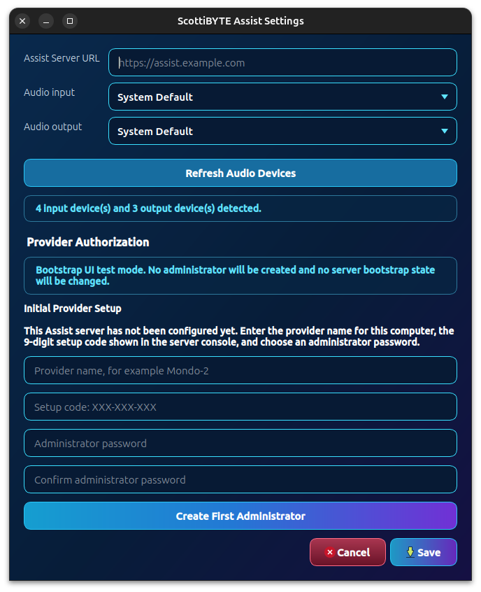
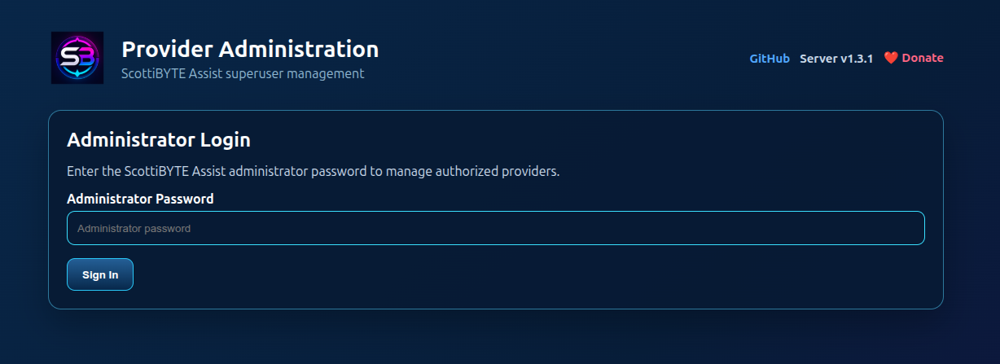
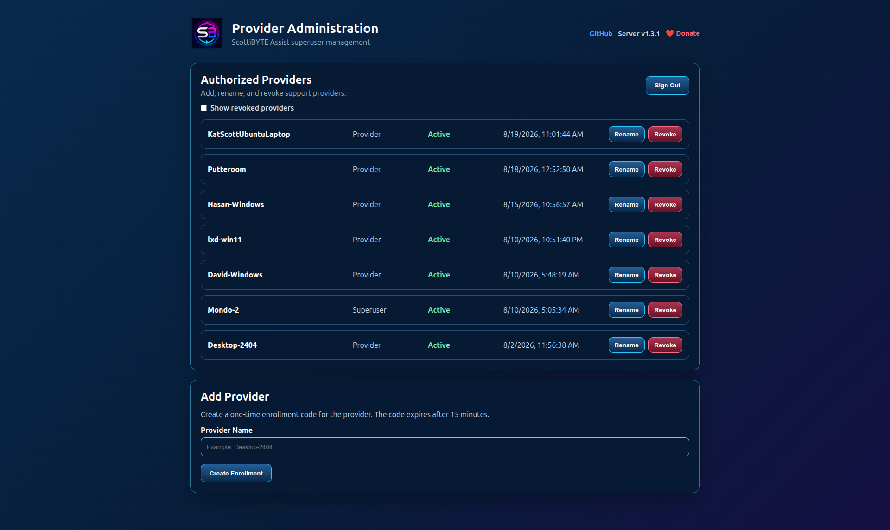
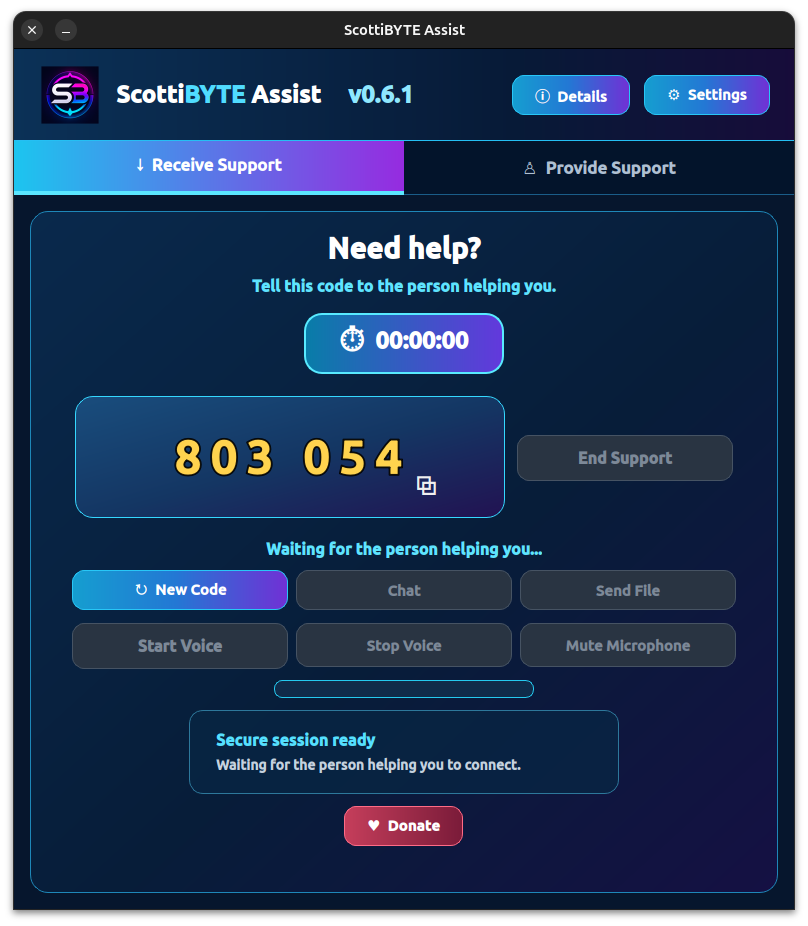
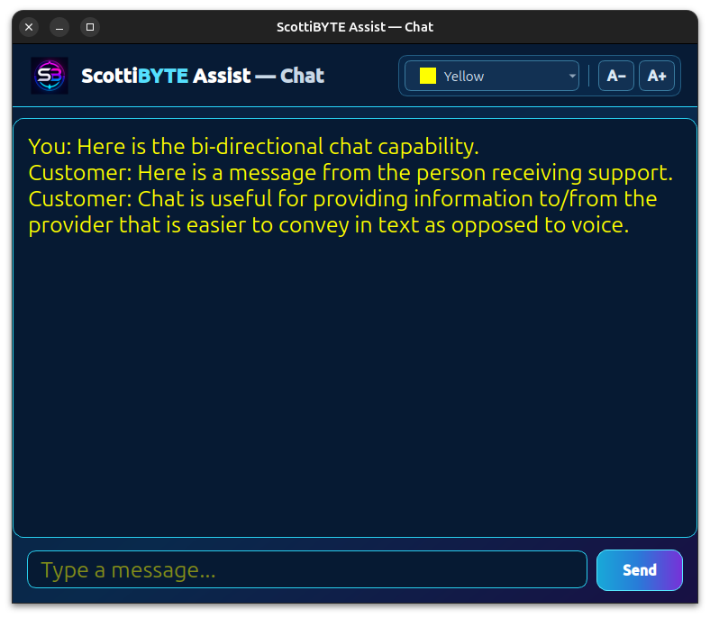

# Installing ScottiBYTE Assist

ScottiBYTE Assist is a self-hosted platform for **attended remote
assistance** between Windows and Linux computers.

The ScottiBYTE Assist server provides provider authorization, session
coordination, WebSocket signaling, client downloads, and provider
administration.

This guide takes a new installation from an empty Docker host through
creation of the first ScottiBYTE Assist superuser.

---

## 1. Requirements

You will need:

- A Linux system running Docker
- Docker Compose
- A DNS hostname for ScottiBYTE Assist
- A reverse proxy capable of proxying WebSockets
- A valid TLS certificate for the public hostname

This guide uses:

```text
assist.example.com
```

as the example public hostname.

Replace it with your actual hostname.

The ScottiBYTE Assist server listens on:

```text
TCP 3089
```

A typical Internet-facing installation is:

```text
Internet
   |
   | HTTPS / WSS
   | TCP 443
   v
https://assist.example.com
   |
   v
Reverse Proxy
   |
   | HTTP / WebSocket
   | TCP 3089
   v
ScottiBYTE Assist Server
```

Users and ScottiBYTE Assist clients normally connect to the public HTTPS
hostname, not directly to port 3089.

---

## 2. Create the ScottiBYTE Assist Server

Create a directory for ScottiBYTE Assist:

```bash
mkdir -p ~/scottibyte-assist
cd ~/scottibyte-assist
mkdir -p data
```

Create a file named:

```text
docker-compose.yml
```

with the following contents:

```yaml
services:
  assist-server:
    image:
      scottibyte/scottibyte-assist-server:latest

    container_name:
      scottibyte-assist-server

    restart:
      unless-stopped

    environment:
      NODE_ENV: production
      HOST: 0.0.0.0
      PORT: 3089
      DATABASE_PATH: /app/data/assist.sqlite
      SESSION_LIFETIME_MINUTES: 30

    ports:
      - "3089:3089"

    volumes:
      - ./data:/app/data

    healthcheck:
      test:
        - CMD
        - wget
        - --quiet
        - --spider
        - http://127.0.0.1:3089/api/health
      interval: 30s
      timeout: 5s
      retries: 3
      start_period: 10s
```

Start ScottiBYTE Assist:

```bash
docker compose up -d
```

Check the container:

```bash
docker compose ps
```

The ScottiBYTE Assist container should be running and become healthy.

Check the server directly:

```bash
curl http://127.0.0.1:3089/api/health
```

A successful response will resemble:

```json
{
  "status": "ok",
  "service": "scottibyte-assist-server"
}
```

The actual response also reports the currently running server version and additional server status information.

At this point the ScottiBYTE Assist server is running locally.

Before configuring the first provider, make the server available at its
permanent public HTTPS address.

---

## 3. Configure DNS

Create a DNS record for the hostname that will be used by ScottiBYTE
Assist.

For example:

```text
assist.example.com
```

should resolve to the public address through which your reverse proxy can
be reached.

The public ScottiBYTE Assist address will then be:

```text
https://assist.example.com
```

This base URL is important because it is also the **Server URL** entered
into the Windows and Linux ScottiBYTE Assist clients.

---

## 4. Configure the Reverse Proxy

Configure your reverse proxy to accept HTTPS connections for:

```text
https://assist.example.com
```

and forward them to:

```text
http://ASSIST-SERVER-IP:3089
```

For example, if the ScottiBYTE Assist server has an internal address of:

```text
192.168.1.50
```

the proxy relationship would be:

```text
https://assist.example.com
        |
        | HTTPS / WSS :443
        v
Reverse Proxy
        |
        | HTTP / WebSocket
        v
http://192.168.1.50:3089
```

Use the actual internal address of your ScottiBYTE Assist server.

### Nginx Proxy Manager

When using Nginx Proxy Manager, create a **Proxy Host** with:

```text
Domain Names:
assist.example.com

Scheme:
http

Forward Hostname / IP:
<Assist server IP address>

Forward Port:
3089

Websockets Support:
Enabled
```

Configure an SSL certificate and enable:

```text
Force SSL
```

ScottiBYTE Assist maintains WebSocket connections during active support
sessions.

In the **Advanced** section of the Nginx Proxy Manager Proxy Host, add:

```nginx
proxy_read_timeout 3600s;
proxy_send_timeout 3600s;
send_timeout 3600s;

proxy_buffering off;
proxy_request_buffering off;
```

These settings help prevent the reverse proxy from terminating a
long-running ScottiBYTE Assist session.

---

## 5. Verify the Public ScottiBYTE Assist Server

Open:

```text
https://assist.example.com
```

You should see the ScottiBYTE Assist portal.


The two primary web addresses are:

```text
ScottiBYTE Assist portal:
https://assist.example.com

Administrator portal:
https://assist.example.com/admin
```

The address entered into a ScottiBYTE Assist client is the base address:

```text
https://assist.example.com
```

Do not enter the `/admin` address into the client.

You can also verify the server through the public address:

```bash
curl https://assist.example.com/api/health
```

Once the portal and health check work through HTTPS, the server side of
the initial installation is ready.

---

## 6. Obtain the Initial Setup Code

A brand-new ScottiBYTE Assist server automatically generates a
**one-time nine-digit setup code** when no provider administrator exists.

Display the server log:

```bash
cd ~/scottibyte-assist
docker compose logs
```

Look for a message similar to:

```text
====================================================
ScottiBYTE Assist — Initial Provider Setup

No provider administrator exists.

One-time setup code:  123-456-789

Enter this code on the first computer that will
administer ScottiBYTE Assist.

This code becomes invalid after first enrollment.
====================================================
```

The code above is only an example.

Use the code generated by your own ScottiBYTE Assist server.

This nine-digit setup code authorizes creation of the first provider.
The first successfully enrolled provider becomes the ScottiBYTE Assist
superuser.

After successful enrollment, the initial setup code becomes invalid.

---

## 7. Install the First ScottiBYTE Assist Client

On the Windows or Linux computer that will administer ScottiBYTE Assist,
open:

```text
https://assist.example.com
```

Download the appropriate ScottiBYTE Assist client from the portal and
install it.

Start ScottiBYTE Assist.

The normal ScottiBYTE Assist client interface provides access to both
receiving and providing support.

Before this computer can provide support, it must be authorized by the
new ScottiBYTE Assist server.

Open **Settings**.

---

## 8. Configure the First Provider

The ScottiBYTE Assist Settings screen is used for first-time provider
configuration and authorization.



For **Server URL**, enter the public base URL of your ScottiBYTE Assist
server:

```text
https://assist.example.com
```

The Server URL is the same address used to reach the public ScottiBYTE
Assist portal.

Do not enter:

```text
https://assist.example.com/admin
```

Do not enter:

```text
https://assist.example.com/ws
```

When using the recommended reverse-proxy configuration, do not enter:

```text
https://assist.example.com:3089
```

The ScottiBYTE Assist client determines the required API and WebSocket
endpoints automatically from the base Server URL.

### Complete Initial Provider Setup

Because this is the first provider on a new server, enter the
**nine-digit one-time setup code** obtained from:

```bash
docker compose logs
```

The setup code looks similar to:

```text
123-456-789
```

Use the code generated by your own ScottiBYTE Assist server.

During this initial authorization, configure:

- the nine-digit one-time setup code;
- the name of the provider computer; and
- an administrator password.

The administrator password must be at least **10 characters** long.

Complete the provider authorization process.

The server creates an individual provider credential for this computer.
Because this is the first provider enrolled on the server, it is assigned
the **superuser** role.

The provider credential is retained by the ScottiBYTE Assist client and
authorizes that computer to provide support. It is separate from the
administrator password.

The administrator password is used to sign in to the web-based
administrator portal at:

```text
https://assist.example.com/admin
```

After successful initial authorization, the nine-digit setup code becomes
invalid and is no longer needed.

You can verify that initial setup has completed:

```bash
curl https://assist.example.com/api/bootstrap/status
```

The result should be:

```json
{
  "bootstrapRequired": false
}
```

The first ScottiBYTE Assist provider, superuser authorization, and
administrator password are now configured.

---

## 9. Administrator Portal

The ScottiBYTE Assist administrator portal is:

```text
https://assist.example.com/admin
```

This is a separate administrative interface.

It is **not** the Server URL entered into ScottiBYTE Assist clients.

Sign in using the **administrator password created during the initial
provider setup**.

The administrator login page appears as follows:



The administrator password and provider credential serve different
purposes:

- The **administrator password** provides access to the web administrator
  portal.
- The **provider credential** authorizes an individual ScottiBYTE Assist
  client to provide remote assistance.

After authentication, the administrator can manage computers authorized
to provide support.



Each provider computer receives its own authorization.

This allows individual provider computers to be managed or revoked
without affecting the authorization belonging to other providers.

---

## 10. Enroll Additional Providers

The nine-digit initial setup code is used only to create the first
provider on a new ScottiBYTE Assist server.

Additional provider computers are enrolled through the ScottiBYTE Assist
provider administration system.

Open:

```text
https://assist.example.com/admin
```

and create an enrollment for the new provider.

On the computer being enrolled:

1. Install ScottiBYTE Assist.
2. Start ScottiBYTE Assist.
3. Open **Settings**.
4. Set **Server URL** to `https://assist.example.com`.
5. Choose the provider enrollment option.
6. Enter the enrollment code created by the administrator.
7. Complete enrollment.

The new provider receives its own authorization for the ScottiBYTE Assist
server.

The administrator can subsequently revoke that provider without changing
the authorization belonging to other providers.

---

## 11. Understanding ScottiBYTE Assist Codes

ScottiBYTE Assist uses different temporary codes for different purposes.

### Initial Setup Code

Example:

```text
123-456-789
```

This nine-digit code is generated when a new server has no provider
administrator.

It is used once to create the first provider and superuser.

After successful initial enrollment, it becomes invalid.

### Provider Enrollment Code

A provider enrollment code is created by an administrator when
authorizing an additional provider computer.

It is not the initial server setup code.

### Support Session Code

Example:

```text
505403
```

A six-digit support code identifies an individual attended support
session.

The person receiving assistance gives this code to the provider who will
assist them.

The support code does not authorize a computer as a provider and does not
create permanent unattended access.

These codes serve different purposes and are not interchangeable.

---

## 12. Receiving Support

A person who needs assistance starts ScottiBYTE Assist and chooses to
receive support.



ScottiBYTE Assist creates a temporary six-digit support code.

The person receiving assistance gives that code to the trusted provider
who will assist them.

The support code authorizes participation in that support session.

ScottiBYTE Assist is designed around **attended remote assistance**.
Creating a support session does not leave the customer's computer
permanently available for future remote control.

---

## 13. Providing Support

An authorized provider starts ScottiBYTE Assist and chooses to provide
support.


The provider enters the six-digit support code supplied by the customer.

The ScottiBYTE Assist server validates the authorized provider and
coordinates the support session.

Once the session has been established, the provider can use the remote
assistance capabilities available during that session.

ScottiBYTE Assist deliberately focuses on **remote assistance rather than
permanent unattended remote control**.

---

## 14. Session Communication

ScottiBYTE Assist provides communication capabilities for participants
during an active support session.



Text chat can be useful for exchanging URLs, commands, filenames, and
other information while assisting the customer.

---

## 15. Architecture

At a high level, ScottiBYTE Assist consists of the central ScottiBYTE
Assist server and Windows and Linux client applications.


The server provides shared services including:

- Provider authorization
- Provider enrollment
- Session coordination
- WebSocket signaling
- Client downloads
- Release information
- Provider administration

The Windows and Linux applications provide the customer and provider
interfaces used during attended support sessions.

For additional architectural information, see:

```text
docs/architecture.md
```

---

## 16. Important Addresses

Assuming the public hostname is:

```text
assist.example.com
```

the important addresses are:

| Purpose | Address |
| --- | --- |
| Public portal and client downloads | `https://assist.example.com` |
| Client Server URL | `https://assist.example.com` |
| Administrator portal | `https://assist.example.com/admin` |
| Server health | `https://assist.example.com/api/health` |
| Initial setup status | `https://assist.example.com/api/bootstrap/status` |

The WebSocket endpoint used automatically by ScottiBYTE Assist clients is:

```text
wss://assist.example.com/ws
```

Users do not normally configure the WebSocket endpoint manually.

The important distinction is:

```text
https://assist.example.com
```

is the public portal **and the Server URL entered into the client**, while:

```text
https://assist.example.com/admin
```

is the provider administration portal.

---

## 17. Updating the ScottiBYTE Assist Server

The installation uses the stable:

```text
scottibyte/scottibyte-assist-server:latest
```

Docker image.

To retrieve the current stable server image:

```bash
cd ~/scottibyte-assist
docker compose pull
docker compose up -d
```

Verify the updated server:

```bash
docker compose ps
```

and:

```bash
curl http://127.0.0.1:3089/api/health
```

The health response reports the server version currently running.

---

## 18. Troubleshooting

### The Docker Container Does Not Start

Check:

```bash
docker compose ps
```

and:

```bash
docker compose logs --tail=100
```

Verify the local health endpoint:

```bash
curl http://127.0.0.1:3089/api/health
```

### The Local Server Works but the Public Portal Does Not

If:

```bash
curl http://127.0.0.1:3089/api/health
```

works but:

```text
https://assist.example.com
```

does not, check:

- DNS
- TLS certificate configuration
- Reverse proxy configuration
- Firewall rules
- Forwarding to TCP port 3089

### The Portal Works but Support Sessions Fail

The web portal can work even when WebSocket proxying is not working
correctly.

Verify that **Websockets Support** is enabled in Nginx Proxy Manager.

Verify the Advanced configuration:

```nginx
proxy_read_timeout 3600s;
proxy_send_timeout 3600s;
send_timeout 3600s;

proxy_buffering off;
proxy_request_buffering off;
```

Watch the server while a client connects:

```bash
docker compose logs -f
```

### The Client Cannot Connect

Verify that the client Server URL is:

```text
https://assist.example.com
```

Do not use:

```text
https://assist.example.com/admin
```

or:

```text
https://assist.example.com/ws
```

The client determines the required ScottiBYTE Assist endpoints from the
base Server URL.

### The Initial Setup Code Is Not Shown

Check the bootstrap state:

```bash
curl https://assist.example.com/api/bootstrap/status
```

If the response is:

```json
{
  "bootstrapRequired": false
}
```

the server already has a provider administrator.

Do not reinitialize the server merely to add another provider.

Use:

```text
https://assist.example.com/admin
```

to create an enrollment for an additional provider.

### A Provider Computer Needs to Be Removed

Open:

```text
https://assist.example.com/admin
```

and revoke the provider authorization for that computer.

Because each provider has its own authorization, revoking one provider
does not require changing the credentials of the other authorized
providers.

---

## 19. First-Time Installation Checklist

A new ScottiBYTE Assist installation is ready when:

- [ ] Docker and Docker Compose are installed.
- [ ] `docker-compose.yml` has been created.
- [ ] The ScottiBYTE Assist container is running and healthy.
- [ ] DNS resolves the ScottiBYTE Assist hostname.
- [ ] HTTPS is working.
- [ ] The reverse proxy forwards traffic to TCP port 3089.
- [ ] WebSocket support is enabled.
- [ ] WebSocket timeout settings are configured.
- [ ] `https://assist.example.com` displays the public portal.
- [ ] The nine-digit initial setup code has been obtained from the server log.
- [ ] The first Windows or Linux client has been installed.
- [ ] Its Server URL is `https://assist.example.com`.
- [ ] The initial setup code has been used to authorize the first provider.
- [ ] The first provider is authorized as the superuser.
- [ ] `/api/bootstrap/status` reports `bootstrapRequired: false`.
- [ ] `https://assist.example.com/admin` opens the administrator portal.

The ScottiBYTE Assist installation is now ready for provider enrollment
and attended remote assistance.
